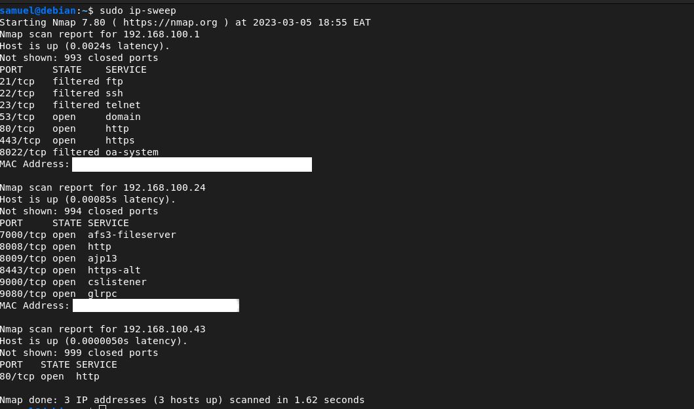

# IP-Sweep
This is a bash project to automatically detect and scan your local network for devices connected to it



## How it Works
The script will work as follows:
- Automatically discover the IP of the network you are connected to
- Discover the devices connected to it with a ping sweep
- Peform an Nmap scan on said devices to find open ports

### Pros
- Saves a lot of time compared to running Nmap alone
- There is no need to type several commands before starting

### Cons
- The script won't get any device that is not pingable

## Install ifconfig if missing:
You don’t need to install ipconfig, because we already have an inbuilt tool to check the ip-address that is: 
```
ip a
```
But if you really want to, simply follow the steps:

### Step 1. Run systemp Update
The first thing is to do is running of system update command to refresh the system repo and install the latest available version of the already installed packages.
```
$ sudo apt update
```

### Step 2. Command to install ifconfig
The network tool is available via net-tools that is available via the default-based repository for the Debian operating system. Hence, simply run:
```
$ sudo apt install net-tools
```

### Step 3. Add ifconfig to the system path
By default, you won’t be able to use the command because it is not in the system path. If you don’t want to add it to the path then use- `sbin/ifconfig`

However, for ease, us the below steps:

```
$ sudo nano ~/.bashrc
```

The above step can be done by using your favorite text editor. Vim, Emacs, gedit . . . e.t.c

Scroll to the end of the file and add:
```
$ export PATH=/usr/sbin:$PATH
```

Save and reboot your machine.

### Step 4. Use the ifconfig
After the installation, you can check out your network interface with ifconfig . In the given screenshot you can see, there are two interfaces. One interface is our lo or loopback (localhost). It is mainly used for diagnostics, troubleshooting, and connecting to servers running on the local computer. The first is enp0s3 , which is called ” eth0 ” on the physical computer.


## Add the script to your $PATH
This will enable you to use some command to run this script from anywhere in your machine ( terminal ofcourse )

Before doing this, make sure you give it executable priviledges
```
chmod +x ip-sweep
```

copy this script into $PATH
```
sudo cp ip-sweep /usr/local/bin
```

### Note: You can call your script whatever you need


## Usage:
To run this command and perform the network sweep, you can use the name of the file.

i.e:
```
$ ip-sweep
```

if you need root priviledges, simply add sudo infront of the command
```
sudo ip-sweep
```
## Happy Coding